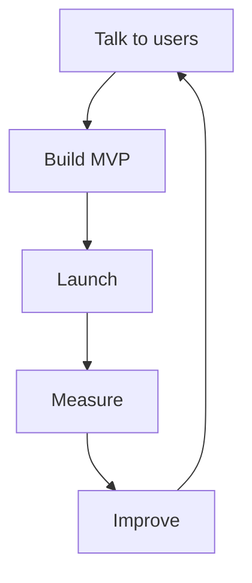

# Chapter 1 — Why Startups Win

> **Core Principle:** Great startups win because they learn faster than everyone else.

## Learning Objectives

- Understand why startups exist.
- Understand why speed of learning matters.
- Understand why AI accelerates execution but does not replace founder judgment.

## Main Content

A startup is an organization designed to search for a repeatable and scalable business model under uncertainty.

Large companies optimize existing systems. Startups optimize learning.

## AI Founder Perspective

AI increases the speed of prototyping, coding, analysis, and publishing. But it does not replace customer discovery, judgment, distribution, or product-market fit.

## Diagram

## Checklist

- [ ] Talk to at least 10 users this week.
- [ ] Identify the riskiest assumption.
- [ ] Ship one improvement.
- [ ] Measure user response.

## Key Takeaways

- Startups win by learning faster.
- AI is a force multiplier, not a substitute for founder judgment.
- Weekly customer feedback compounds.

## Sources

- Add public YC and Startup School sources during research review.
