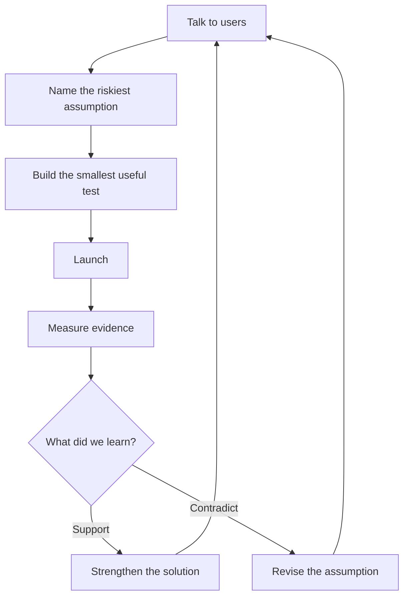

# Chapter 1 — Why Startups Win

> **Core Principle:** Great startups create an advantage by learning from users
> and turning that learning into focused action.

## Learning Objectives

- Understand why learning speed matters under startup uncertainty.
- Connect user conversations to a focused minimum viable product.
- Use AI to shorten execution loops without replacing founder judgment.

## Deep Dive

An early-stage startup operates without a predictable path. Its founders must
choose which problem to solve, learn whether users care, and adapt before time
and money run out. Michael Seibel describes startup life as demanding personal
responsibility under low odds and uncertainty, while also forcing founders to
learn faster.[^seibel]

Learning is only useful when it changes action. Y Combinator's description of
its own engineering principles emphasizes staying close to users, moving fast,
and launching early.[^yc-software] For a founder, that creates a practical
loop: talk to users, identify the riskiest assumption, build the smallest useful
test, launch it, and examine what happened.

The minimum viable product is not an excuse for an incomplete experience. YC's
MVP guidance argues that an MVP should tell a complete story with a clear
purpose and only the features required to serve that purpose.[^mvp] The goal is
to reduce the time between an assumption and trustworthy evidence.

## AI Founder Interpretation

AI can accelerate prototyping, coding, analysis, and documentation. That can
make each build-and-review cycle cheaper. It cannot decide which customer pain
matters, conduct accountable customer discovery, or accept the consequences of
a strategic decision.

Use AI to shorten the mechanical parts of the loop. Keep the founder directly
responsible for user contact, evidence quality, prioritization, and the decision
to continue, change direction, or stop.

## Callouts

### Decision Lens

> **Decision Lens:** Which current unknown would most change what you do next?

### Common Failure

> **Common Failure:** Fast output is not the same as fast learning. A team can
> generate many features with AI while learning very little. Count supported or
> contradicted assumptions, not lines of code or prompts completed.

## Diagram

## Checklist

- [ ] Talk to at least 10 relevant users this week.
- [ ] Write down the riskiest current assumption.
- [ ] Define what evidence would support or contradict it.
- [ ] Ship one focused test.
- [ ] Review actual user behavior and feedback.
- [ ] Record the decision and the evidence behind it.

## Worksheet

| Prompt | Your answer |
| --- | --- |
| Target user | |
| Painful situation | |
| Riskiest assumption | |
| Smallest useful test | |
| Evidence to collect | |
| Review date | |
| Decision after review | |

## Key Takeaways

- Startups gain an advantage by converting user evidence into focused action.
- A useful MVP tests a clear purpose rather than presenting a random subset of
  features.
- AI is a force multiplier for execution, not a substitute for customer
  discovery or founder judgment.
- A short learning loop compounds only when the team records and applies what
  it learns.

## Sources

- [Why Should I Start a Startup? — Y Combinator](https://www.ycombinator.com/blog/why-should-i-start-a-startup/)
- [Software at YC — Y Combinator](https://www.ycombinator.com/software)
- [Practical Design: MVP Spec — Y Combinator](https://www.ycombinator.com/blog/practical-design-mvp)

[^seibel]: Michael Seibel, “Why Should I Start a Startup?”, Y Combinator.
[^yc-software]: “Software at YC”, Y Combinator.
[^mvp]: Dominika Blackappl, “Practical Design: MVP Spec”, Y Combinator.
