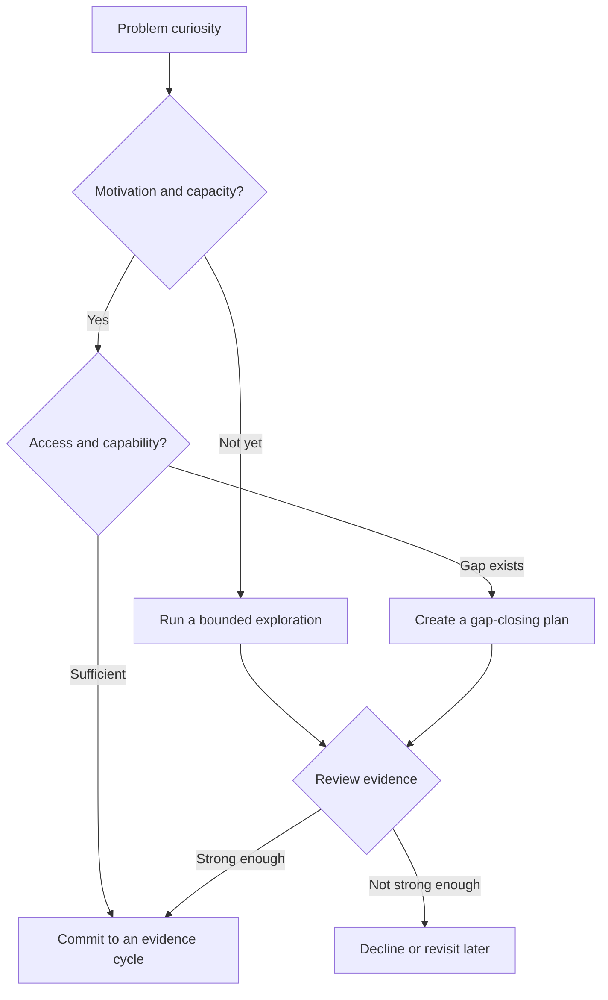

# Chapter 2 — Should You Start This Company?

> **Core Principle:** Start because you are willing and able to pursue a real
> problem, not because “founder” sounds like the right identity.

## Learning Objectives

- Separate curiosity about a problem from commitment to a company.
- Assess your motivation, capacity, access, and founding-team needs.
- Choose to commit, explore part-time, or decline without treating any option
  as a personal failure.

## Deep Dive

Starting a company is a choice about how you will spend years of attention
under uncertainty. The first question is not whether the idea sounds large. It
is whether you care enough about the problem to keep learning when the first
solution is wrong.

Michael Seibel argues that people differ in how well startup life fits them and
that being capable of founding does not mean you should do it.[^readiness] YC’s
FAQ also says solo founders may apply while noting that one-person startups are
tough, and it emphasizes that a founding team should be able to build its own
product.[^faq] Treat those points as prompts, not universal rules.

Use four readiness dimensions:

1. **Motivation:** Would you still investigate this problem without status,
   press, or immediate funding?
2. **Capacity:** Can you protect enough time, health, and financial stability to
   conduct a serious test?
3. **Access:** Can you reach people who experience the problem and observe the
   work in context?
4. **Capability:** Can the current team build, sell, and learn, or is a critical
   skill unowned?

You do not need perfect readiness. You need an honest plan for the gaps. A
two-week exploration can be the right next step when a full commitment would be
premature. Write what would make you commit and what would make you stop.

## AI Founder Interpretation

AI can help you list constraints, model scenarios, and turn scattered notes
into a readiness memo. It cannot know how much uncertainty your family can
absorb, whether you trust a potential co-founder, or whether the problem will
hold your attention.

Do not ask a model, “Should I start this company?” Ask it to challenge the
specific evidence in your memo. You remain responsible for the decision and
for conversations with people affected by it.

## Callouts

### Decision Lens

> **Decision Lens:** If nobody praised this idea for six months, would you still
> want to understand the problem?

### Common Failure

> **Common Failure:** Treating fundraising interest as permission to start.
> Investor attention tests investor interest, not user need or founder fit.

## Diagram

## Checklist

- [ ] Write why this problem matters to you without mentioning valuation or
  recognition.
- [ ] Estimate the weekly time and personal runway you can actually protect.
- [ ] Name five people you can contact who experience the problem.
- [ ] List the product, sales, domain, and operating skills currently owned.
- [ ] Choose a commitment or exploration review date.

## Worksheet

| Prompt | Your answer |
| --- | --- |
| Problem I want to understand | |
| Motivation that survives weak external attention | |
| Weekly time available | |
| Personal constraints | |
| Users I can reach | |
| Critical capability gap | |
| Commit, explore, or decline | |
| Review date and stopping condition | |

## Key Takeaways

- Founder readiness is a decision about a problem, constraints, and team—not an
  identity test.
- A bounded exploration is valid when full commitment is not yet justified.
- AI may challenge a readiness memo, but people must own consequential personal
  and team choices.
- Write commitment and stopping conditions before enthusiasm changes them.

## Sources

- [Why Should I Start a Startup? — Y Combinator](https://www.ycombinator.com/blog/why-should-i-start-a-startup/)
- [Frequently Asked Questions — Y Combinator](https://www.ycombinator.com/faq)

[^readiness]: Michael Seibel, “Why Should I Start a Startup?”, Y Combinator.
[^faq]: “Frequently Asked Questions”, Y Combinator.
