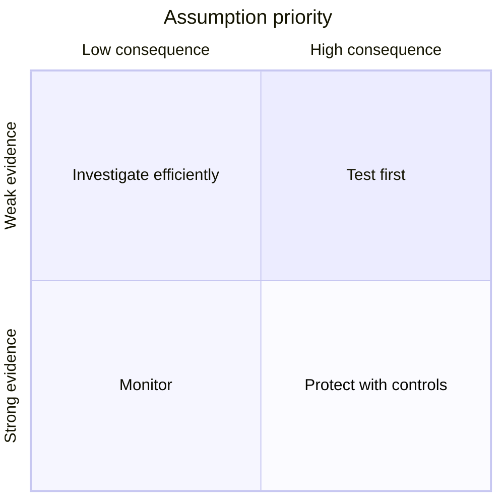

# Chapter 4 — Define Your Riskiest Assumptions

> **Core Principle:** Test the uncertain belief that would most damage the plan
> if it were false.

## Learning Objectives

- Separate facts, interpretations, and assumptions in a startup plan.
- Rank assumptions by uncertainty and consequence.
- Define evidence and a small test for the highest-priority assumption.

## Deep Dive

Every early plan hides beliefs: the user experiences the problem, the problem
is important now, the proposed outcome helps, the team can deliver it, AI can
perform reliably enough, and a sustainable exchange of value is possible.
Writing these beliefs makes the plan easier to change.

YC’s Startup Playbook emphasizes starting with a good product and talking to
users rather than relying on an elaborate plan.[^playbook] In his application
guidance, Paul Graham asks founders to show specific insight, acknowledge
obstacles, and explain a theory for overcoming them.[^apply] FounderOS
synthesizes those ideas into an assumption map: expose the obstacle before
investing heavily in the solution.

Label statements carefully:

- **Observed fact:** “Four clinic coordinators described copying appointment
  details between the same two systems last week.”
- **Interpretation:** “The repeated copying may be a meaningful workflow
  bottleneck.”
- **Assumption:** “A coordinator will adopt and trust an AI-assisted transfer.”

Rank each assumption on two axes. Uncertainty asks how weak the evidence is.
Consequence asks how much of the plan fails if the belief is false. A highly
uncertain detail with little consequence can wait. A consequential belief with
strong evidence should still be monitored. The first test belongs in the
high-uncertainty, high-consequence corner.

Precommit the evidence rule: what observation supports the assumption, what
contradicts it, how many cases are informative, and when you will review. The
test should be small enough to run before building the full product.

## AI Founder Interpretation

Ask AI to extract hidden assumptions from a memo and argue how each could be
wrong. This is useful adversarial assistance, not evidence. A model may invent
confidence, sources, or user behavior when the prompt is incomplete.

Keep a human-owned assumption register with source links, dates, and decisions.
For AI product assumptions, include quality, latency, cost, privacy, misuse,
and fallback behavior—not only whether a demo works.

## Callouts

### Decision Lens

> **Decision Lens:** If you learned one belief was false tomorrow, which one
> would force the largest change to the user, product, or business?

### Common Failure

> **Common Failure:** Testing what is easiest to measure. A landing-page click
> may be simple to count while leaving the core workflow and willingness to
> change completely untested.

## Diagram

## Checklist

- [ ] Highlight facts, interpretations, and assumptions in different ways.
- [ ] Include user, problem, solution, channel, business, and AI-operation
  assumptions.
- [ ] Rank each belief by uncertainty and consequence.
- [ ] Choose one assumption for the next test.
- [ ] Write supporting, contradicting, and inconclusive evidence rules.
- [ ] Set an owner and review date.

## Worksheet

| Assumption | Current evidence | Uncertainty | Consequence | Next test | Review date |
| --- | --- | --- | --- | --- | --- |
| User | | | | | |
| Problem | | | | | |
| Solution | | | | | |
| AI quality or safety | | | | | |
| Channel or business | | | | | |

## Key Takeaways

- An explicit assumption is easier to test and revise than a hidden belief.
- Test priority depends on both uncertainty and consequence.
- Evidence rules should be written before results invite reinterpretation.
- AI can challenge an assumption map but cannot supply missing user evidence.

## Sources

- [Startup Playbook — Y Combinator](https://www.ycombinator.com/blog/startup-playbook/)
- [How to Apply to Y Combinator — Y Combinator](https://www.ycombinator.com/howtoapply.html)

[^playbook]: Sam Altman, “Startup Playbook”, Y Combinator.
[^apply]: Paul Graham, “How to Apply to Y Combinator”, Y Combinator.
