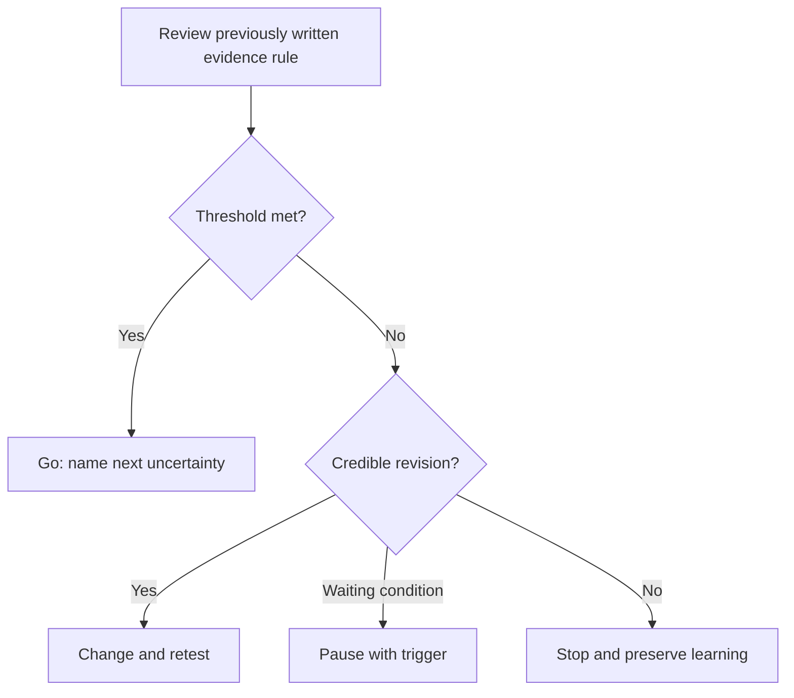

# Chapter 8 — Decide: Go, Change, or Stop

> **Core Principle:** Make the next decision from previously written evidence rules, not
> from effort already spent.

## Learning Objectives

- Distinguish continuing, changing, pausing, and stopping.
- Compare observed evidence with a threshold set in advance.
- Record a decision, rationale, owner, and next review date.

## Deep Dive

Discovery is useful only when it changes a decision. At the end of a cycle,
review the ranked assumption, the test, the evidence, and the limits of that
evidence. Do not ask whether the idea is “good.” Ask what action the evidence
supports now.

Michael Seibel warns against declaring product-market fit without the demanding
conditions that term implies.[^fit] Paul Graham’s application guidance values
founders who recognize obstacles and offer a theory for addressing them.[^apply]
Together they support an honest decision gate before confident labels.

Use four outcomes:

- **Go:** repeat or deepen the same path because evidence crossed the threshold.
- **Change:** revise the user, problem, promise, channel, or delivery approach.
- **Pause:** preserve the learning while waiting for a named condition.
- **Stop:** end this path because the evidence or constraint makes further work
  unjustified.

“Change” must name what changes and what stays stable. “Pause” needs a trigger
and date or it becomes avoidance. “Go” should still name the next uncertainty.

## AI Founder Interpretation

AI can build an evidence table and argue for each decision. Do not ask it to
make the final call. It lacks responsibility for sunk costs, relationships,
runway, and user consequences.

Preserve minority evidence and source links so a polished summary cannot erase
the reasons for caution.

## Callouts

### Decision Lens

> **Decision Lens:** What would you decide if a different team had produced the
> same evidence with half the effort?

### Common Failure

> **Common Failure:** Moving the success threshold after weak results arrive.
> Record the change as a new test instead of rewriting the old one.

## Diagram

## Checklist

- [ ] Compare evidence with the original threshold.
- [ ] Record contradictory and missing evidence.
- [ ] Choose go, change, pause, or stop.
- [ ] Name what changes and what stays stable.
- [ ] Assign the next action and review date.

## Worksheet

| Prompt | Your answer |
| --- | --- |
| Assumption tested | |
| Original evidence rule | |
| Supporting evidence | |
| Contradictory evidence | |
| Decision | |
| What changes or continues | |
| Owner and review date | |

## Key Takeaways

- Discovery must end in an explicit action.
- Previously written thresholds reduce convenient reinterpretation.
- Pausing and stopping can preserve resources and learning.
- AI can challenge a decision but cannot own it.

## Sources

- [The Real Product Market Fit — Y Combinator](https://www.ycombinator.com/blog/the-real-product-market-fit/)
- [How to Apply to Y Combinator — Y Combinator](https://www.ycombinator.com/howtoapply.html)

[^fit]: Michael Seibel, “The Real Product Market Fit”, Y Combinator.
[^apply]: Paul Graham, “How to Apply to Y Combinator”, Y Combinator.
