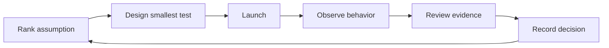

# Chapter 10 — Run the Founder Learning Loop

> **Core Principle:** Every build cycle should answer one important question.

## Learning Objectives

- Turn an assumption into a build-launch-review cycle.
- Choose evidence that can change the next product decision.
- Keep cycle scope small enough for founder contact with users.

## Deep Dive

A learning loop connects work to a decision: assumption, test, release, observed
behavior, review, and next action. Without the final review, iteration becomes a
stream of features.

YC’s essential advice joins launching, talking to users, focus, and rapid
improvement.[^essential] Its Startup Playbook similarly treats product quality,
execution, and growth as connected founder responsibilities.[^playbook]
FounderOS synthesis: set one primary learning question for each cycle.

Begin with the assumption register. Choose the top item and write the smallest
product or service change that exposes it to reality. Define an evidence window,
not just a ship date. At review, compare results with the original rule and
choose go, change, pause, or stop.

Limit work in progress. If a cycle tests a new user, a new problem, a new model,
and a new channel together, a result will be hard to interpret. Change as few
dimensions as practical.

## AI Founder Interpretation

AI can accelerate coding, analysis, test generation, and documentation. Use the
saved time for direct observation and careful review. Require generated changes
to pass the same product, security, and evidence gates as human-written work.

Record which model or tool contributed when that fact affects repeatability.

## Callouts

### Decision Lens

> **Decision Lens:** If the cycle succeeds or fails, will you know what decision
> to make next?

### Common Failure

> **Common Failure:** Calling a sprint a learning loop. Shipping on schedule
> does not create learning unless evidence is reviewed against an assumption.

## Diagram

## Checklist

- [ ] Choose one primary learning question.
- [ ] Define the smallest responsible exposure to users.
- [ ] Write the evidence rule and observation window.
- [ ] Review behavior with at least one user directly.
- [ ] Record the decision before beginning another cycle.

## Worksheet

| Prompt | Your answer |
| --- | --- |
| Assumption | |
| Learning question | |
| Smallest test | |
| Evidence rule | |
| Observation window | |
| Review participants | |
| Decision and next loop | |

## Key Takeaways

- A cycle is complete only after an evidence-backed decision.
- One primary question makes results easier to interpret.
- AI speed should create more observation time, not more uncontrolled scope.
- The assumption register connects one loop to the next.

## Sources

- [YC’s Essential Startup Advice — Y Combinator](https://www.ycombinator.com/blog/ycs-essential-startup-advice/)
- [Startup Playbook — Y Combinator](https://www.ycombinator.com/blog/startup-playbook/)

[^essential]: Geoff Ralston, “YC’s Essential Startup Advice”, Y Combinator.
[^playbook]: Sam Altman, “Startup Playbook”, Y Combinator.
