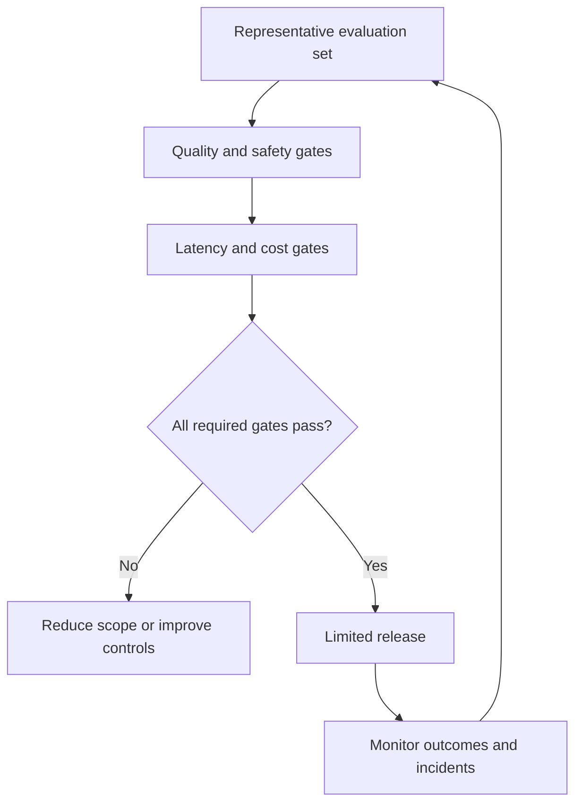

# Chapter 12 — Manage AI Risk, Cost, and Reliability

> **Core Principle:** Release an AI feature only with measured quality, bounded
> cost, safe failure, and named ownership.

## Learning Objectives

- Define an evaluation set connected to the user outcome.
- Establish release limits for quality, latency, cost, privacy, and safety.
- Design monitoring, fallback, and review after release.

## Deep Dive

A successful demo shows that a path can work. A release decision asks how often
it works, for whom, at what cost, under which failures, and with what consequence.

NIST’s AI RMF and Generative AI Profile describe risk management as ongoing work
that includes testing, evaluation, verification, and validation.[^rmf][^profile]
For a small startup, this does not require a large compliance department. It
requires an explicit scorecard proportional to the harm a failure could cause.

Build a representative evaluation set from permitted, de-identified examples.
Include normal, difficult, adversarial, ambiguous, and refusal cases. Measure
task success and critical failure categories rather than a single average.

Set operating limits before launch: acceptable quality, maximum severe-failure
rate, latency budget, cost per completed outcome, data boundary, and fallback.
Track cost per useful outcome—not cost per model call—because retries and human
repair are part of the service.

## AI Founder Interpretation

Model and vendor choice is reversible only when evaluations and interfaces are
portable. Keep a small regression set, version important changes, and rerun the
scorecard before switching a model, prompt, tool, or data source.

If monitoring cannot detect a dangerous failure, reduce scope or keep the
workflow manual.

## Callouts

### Decision Lens

> **Decision Lens:** What failure would make you wish this feature had remained
> unavailable, and how will you detect it?

### Common Failure

> **Common Failure:** Optimizing model-call price while ignoring retries, review,
> support, and the cost of wrong outcomes.

## Diagram

## Checklist

- [ ] Create permitted normal, edge, ambiguous, and adversarial cases.
- [ ] Define critical failure categories and release thresholds.
- [ ] Calculate cost and latency per completed user outcome.
- [ ] Document privacy boundaries, fallback, and owner.
- [ ] Rerun evaluations after material model or workflow changes.

## Worksheet

| Gate | Threshold | Current result | Evidence | Owner | Release action |
| --- | --- | --- | --- | --- | --- |
| Task quality | | | | | |
| Critical failures | | | | | |
| Latency | | | | | |
| Cost per outcome | | | | | |
| Privacy and safety | | | | | |
| Fallback | | | | | |

## Key Takeaways

- A demo is not a reliability evaluation.
- Release gates should match consequence and include safe failure.
- Cost per useful outcome is more informative than cost per call.
- Portable evaluations reduce dependence on a single model or vendor.

## Sources

- [AI Risk Management Framework — NIST](https://www.nist.gov/itl/ai-risk-management-framework)
- [Generative AI Profile — NIST](https://nvlpubs.nist.gov/nistpubs/ai/NIST.AI.600-1.pdf)

[^rmf]: National Institute of Standards and Technology, “AI Risk Management Framework.”
[^profile]: National Institute of Standards and Technology, “Artificial Intelligence Risk Management Framework: Generative Artificial Intelligence Profile.”
