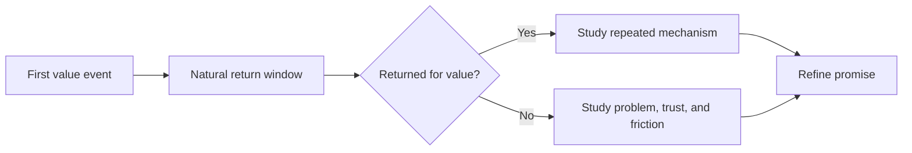

# Chapter 15 — Learn from Early Retention

> **Core Principle:** Study who returns for value, when they return, and why.

## Learning Objectives

- Choose a return interval that matches the natural workflow.
- Build small cohorts without overstating statistical certainty.
- Use return and non-return evidence to refine the user and product.

## Deep Dive

Retention asks whether value repeats. Daily return may be appropriate for a
communication tool and meaningless for a quarterly planning workflow. Choose
the interval from user behavior, not a standard dashboard.

Michael Seibel cautions founders against claiming product-market fit without
strong evidence of demand.[^fit] Paul Graham’s growth essay explains why growth
measurement belongs at the center of a startup, while the appropriate measure
depends on the product.[^growth] Early retention is one input—not a declaration
that fit exists.

Group users by the period they first received value, then observe whether they
repeat the value event in the next natural interval. Segment by wedge, use case,
and acquisition path. With small numbers, show counts beside percentages. Talk
to users who returned, stopped, and never reached value.

Look for mechanisms: Was the problem recurring? Did the output become part of a
workflow? Did trust improve? Did setup block the second use? Use those answers
to sharpen the promise and next test.

## AI Founder Interpretation

AI can calculate cohorts and summarize exit notes. Require it to display raw
counts, definitions, and missing data. A smooth chart from six users remains
six users.

Do not infer sensitive reasons for non-return from behavioral traces alone.

## Callouts

### Decision Lens

> **Decision Lens:** When should a satisfied user naturally need the promised
> outcome again?

### Common Failure

> **Common Failure:** Using a fixed seven-day retention measure for a workflow
> that occurs monthly, then redesigning the product around a false failure.

## Diagram

## Checklist

- [ ] Define the recurring value event and natural interval.
- [ ] Show cohort counts beside percentages.
- [ ] Segment by user, use case, and acquisition path.
- [ ] Interview users who returned and users who did not.
- [ ] Record the mechanism you will test next.

## Worksheet

| Cohort | Reached value | Returned in natural interval | Segment | Observed reason |
| --- | --- | --- | --- | --- |
| | | | | |
| | | | | |
| | | | | |

## Key Takeaways

- Retention intervals should match the real workflow.
- Small cohorts require counts, context, and humility.
- Return behavior matters because it can reveal repeated value.
- Retention supports a decision; it does not automatically prove market fit.

## Sources

- [The Real Product Market Fit — Y Combinator](https://www.ycombinator.com/blog/the-real-product-market-fit/)
- [Startup = Growth — Paul Graham](https://paulgraham.com/growth.html)

[^fit]: Michael Seibel, “The Real Product Market Fit”, Y Combinator.
[^growth]: Paul Graham, “Startup = Growth.”
