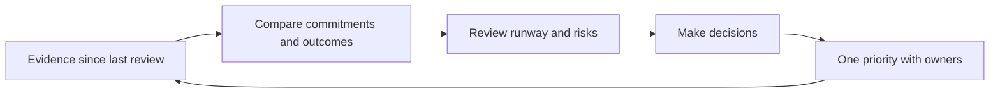

# Chapter 17 — Run a Weekly Founder Cadence

> **Core Principle:** Review evidence, decisions, runway, and commitments on the
> same page every week.

## Learning Objectives

- Establish a repeatable weekly evidence and decision review.
- Separate outcomes from activity and plans from hopes.
- Leave the review with one company priority and named owners.

## Deep Dive

A weekly cadence keeps the company close to reality without turning every new
signal into a strategy change. Use a single operating page that compares last
week’s commitments with outcomes, not busyness.

The Startup Playbook emphasizes focus, intensity, execution, and the CEO’s
responsibilities.[^playbook] YC’s essential advice similarly joins product work
with user contact and focused measures.[^essential] FounderOS synthesis: review
those responsibilities together so one dashboard cannot hide another problem.

Use six sections: user evidence, value behavior, product reliability, AI risk
and cost, runway, and decisions. Begin with what changed. Review broken promises
without blame, then decide the single most important company outcome for the
next week. Assign an owner and a date.

Keep a decision log. Repeatedly reopening an unchanged decision consumes the
attention the cadence is meant to protect.

## AI Founder Interpretation

AI can prepare the page from approved records and flag differences. It should
link to sources and mark missing data. Founders must discuss tradeoffs and own
commitments.

Do not let an automatically generated summary replace direct user stories or
incident details.

## Callouts

### Decision Lens

> **Decision Lens:** What single outcome would make the next seven days most
> informative or valuable?

### Common Failure

> **Common Failure:** Turning the review into status theater where every task is
> green but no user behavior or assumption changed.

## Diagram

## Checklist

- [ ] Review last week’s commitments and actual outcomes.
- [ ] Include user, value, reliability, AI cost and risk, and runway evidence.
- [ ] Record decisions and unresolved assumptions.
- [ ] Choose one company priority for the next week.
- [ ] Assign owners, dates, and the next review time.

## Worksheet

| Weekly section | Evidence | Decision | Owner and date |
| --- | --- | --- | --- |
| User learning | | | |
| Value behavior | | | |
| Product and AI operation | | | |
| Runway | | | |
| Primary company outcome | | | |

## Key Takeaways

- A weekly cadence should compare commitments with outcomes.
- User, product, AI, and financial evidence belong in one decision view.
- One company priority protects focus across many possible tasks.
- AI may prepare evidence, but founders remain responsible for decisions.

## Sources

- [Startup Playbook — Y Combinator](https://www.ycombinator.com/blog/startup-playbook/)
- [YC’s Essential Startup Advice — Y Combinator](https://www.ycombinator.com/blog/ycs-essential-startup-advice/)

[^playbook]: Sam Altman, “Startup Playbook”, Y Combinator.
[^essential]: Geoff Ralston, “YC’s Essential Startup Advice”, Y Combinator.
