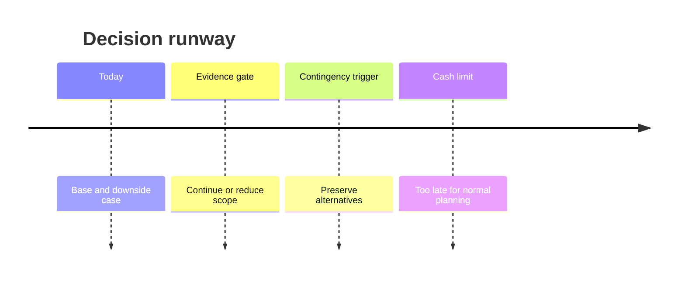

# Chapter 18 — Protect Runway and Priorities

> **Core Principle:** Let the time remaining determine the size and timing of
> your next bet.

## Learning Objectives

- Calculate a simple cash runway and decision runway.
- Connect spending, hiring, and scope to evidence milestones.
- Define a contingency trigger before the company reaches a crisis.

## Deep Dive

Cash runway is available cash divided by net monthly burn. Decision runway asks
a more useful question: how much time remains to learn, act, and preserve an
alternative before cash becomes the only decision.

Paul Graham’s “Default Alive or Default Dead?” recommends knowing whether the
current trajectory reaches profitability before cash runs out and warns against
assuming more funding will arrive.[^alive] YC’s first-time founder advice also
highlights the importance of understanding finances, not only financing.[^first]

Build a base case from actual cash, recurring revenue, committed costs, and
realistic timing. Add a downside case. Mark dates for hiring, model commitments,
vendor contracts, and fundraising. Then set a contingency trigger early enough
to reduce scope, cost, or headcount responsibly.

Tie spending to an evidence milestone. “Hire two engineers” is an input. “Reduce
time to the verified user outcome while maintaining release gates” is closer to
a company result. If the milestone is not reached by the review date, revisit
the spend rather than extending it automatically.

## AI Founder Interpretation

AI can model scenarios and flag unusual changes. It cannot verify bank balances,
contract terms, taxes, or legal obligations. Use authoritative records and
qualified professionals where required.

Include model, data, evaluation, human review, and incident costs in AI service
economics.

## Callouts

### Decision Lens

> **Decision Lens:** What decision must be made while you still have enough
> runway to choose among real alternatives?

### Common Failure

> **Common Failure:** Treating expected fundraising as cash and delaying a
> contingency until every option is painful.

## Diagram

## Checklist

- [ ] Reconcile available cash, revenue, and committed costs.
- [ ] Calculate base and downside runway cases.
- [ ] Include full AI and human operating costs.
- [ ] Tie major spend to an evidence milestone.
- [ ] Set a dated contingency trigger and owner.

## Worksheet

| Input or decision | Base case | Downside case | Evidence source | Review date |
| --- | --- | --- | --- | --- |
| Available cash | | | | |
| Monthly revenue | | | | |
| Monthly costs | | | | |
| Runway | | | | |
| Contingency trigger | | | | |

## Key Takeaways

- Decision runway matters because alternatives disappear before cash reaches zero.
- Hiring and spending should connect to explicit evidence milestones.
- Fundraising is uncertain and should not be treated as committed cash.
- AI scenarios assist planning; authoritative financial records control it.

## Sources

- [Default Alive or Default Dead? — Paul Graham](https://paulgraham.com/aord.html)
- [Advice for First Time Founders — Y Combinator](https://www.ycombinator.com/blog/advice-for-first-time-founders)

[^alive]: Paul Graham, “Default Alive or Default Dead?”
[^first]: “Advice for First Time Founders”, Y Combinator.
