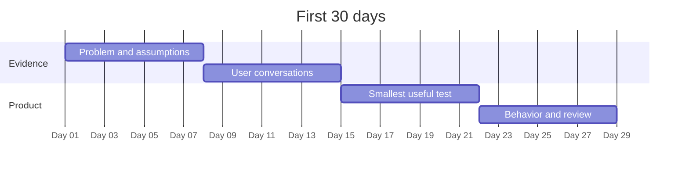

# Chapter 21 — Your First 30 Days

> **Core Principle:** Spend the first month alternating direct user evidence with
> the smallest responsible product tests.

## Learning Objectives

- Sequence four weeks without pretending discovery follows a fixed script.
- Define weekly outputs and evidence gates.
- Adapt the month when evidence contradicts the starting plan.

## Deep Dive

The first 30 days should reduce important uncertainty. It should not produce a
large feature list, a perfect brand, or a fundraising performance.

YC’s essential advice pairs launching with talking to users and staying
focused.[^essential] Michael Seibel’s order of operations moves from a problem
to collaborators, a small product, and first users.[^order] This chapter turns
those ideas into a beginner schedule, not a universal formula.

- **Week 1:** Write founder constraints, problem statement, assumption map, and
  ten relevant contacts.
- **Week 2:** Conduct problem conversations, revise the wedge, and make a go,
  change, pause, or stop decision.
- **Week 3:** Deliver the smallest useful outcome manually or with a narrow
  product; define AI release limits before exposure.
- **Week 4:** Observe value and return behavior, review runway, and choose the
  next learning loop.

Each week ends with a decision record. If evidence invalidates the problem in
week two, do not continue the calendar for appearances. Change or stop.

## AI Founder Interpretation

Use AI to prepare, code, analyze, and document bounded work. Reserve calendar
time for user contact, source review, evaluation, and decisions. AI-generated
volume is not a monthly outcome.

Protect private research data and keep a human owner for every external release.

## Callouts

### Decision Lens

> **Decision Lens:** Which uncertainty must be smaller by day 30 for another
> month of work to be justified?

### Common Failure

> **Common Failure:** Completing the calendar after the evidence says the path
> should change. A plan is a tool, not a promise to your past self.

## Diagram

## Checklist

- [ ] Put user conversations and review gates on the calendar.
- [ ] Define one required output for each week.
- [ ] Set AI quality, safety, cost, and fallback limits before release.
- [ ] Record a decision at the end of every week.
- [ ] Preserve permission to change or stop early.

## Worksheet

| Week | Primary question | Required output | Evidence gate | Actual decision |
| --- | --- | --- | --- | --- |
| 1 | | | | |
| 2 | | | | |
| 3 | | | | |
| 4 | | | | |

## Key Takeaways

- The first month should reduce uncertainty, not maximize output.
- Alternate user contact with small product exposure.
- Weekly decision gates keep the calendar responsive to evidence.
- AI assistance should create time for judgment and observation.

## Sources

- [YC’s Essential Startup Advice — Y Combinator](https://www.ycombinator.com/blog/ycs-essential-startup-advice/)
- [One Order of Operations for Starting a Startup — Y Combinator](https://www.ycombinator.com/blog/one-order-of-operations-for-starting-a-startup/)

[^essential]: Geoff Ralston, “YC’s Essential Startup Advice”, Y Combinator.
[^order]: Michael Seibel, “One Order of Operations for Starting a Startup”, Y Combinator.
