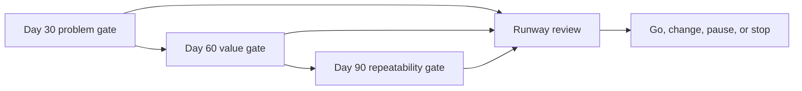

# Chapter 22 — Your First 90 Days

> **Core Principle:** Use 30-day evidence gates, not 90-day outcome fantasies.

## Learning Objectives

- Plan three review windows around assumptions and decisions.
- Connect product evidence, AI operation, and runway.
- Define conditions for continuing, changing, pausing, or stopping.

## Deep Dive

A 90-day plan cannot promise product-market fit, revenue, funding, or growth.
Those outcomes depend on users and systems outside the plan. It can promise
disciplined tests, review dates, and decisions.

Michael Seibel’s product-market-fit guidance warns against premature confidence,
while Paul Graham’s runway guidance asks founders to confront the company’s
trajectory early.[^fit][^alive] Combine those concerns at three gates:

- **Day 30 — Problem gate:** Is one user, situation, and consequence supported
  strongly enough to continue?
- **Day 60 — Value gate:** Can a narrow product repeatedly deliver a useful
  outcome within the AI quality, safety, cost, and trust limits?
- **Day 90 — Repeatability gate:** Do relevant users return, pay, refer, or embed
  the outcome enough to justify the next investment?

Write threshold, source, owner, and possible decision for each gate. Review
runway at every gate. If a decision changes the wedge or product substantially,
reset the relevant evidence clock instead of keeping a cosmetic deadline.

## AI Founder Interpretation

AI can maintain the milestone map and surface missing evidence. It cannot turn a
scheduled target into reality. Label forecasts, assumptions, and observations
separately.

Require a fresh release evaluation after material model, prompt, tool, or data
changes during the 90 days.

## Callouts

### Decision Lens

> **Decision Lens:** What evidence would justify the next 30 days of attention
> and spending at each gate?

### Common Failure

> **Common Failure:** Treating date-based targets as evidence and reporting a
> planned milestone as achieved because the date arrived.

## Diagram

## Checklist

- [ ] Define day 30, 60, and 90 evidence gates.
- [ ] Name the source, threshold, owner, and decision for each.
- [ ] Review AI release controls and runway at every gate.
- [ ] Reset affected evidence after a material change.
- [ ] Record what will trigger pause or stop.

## Worksheet

| Gate | Assumption | Required evidence | Threshold | Runway check | Possible decision |
| --- | --- | --- | --- | --- | --- |
| Day 30 | | | | | |
| Day 60 | | | | | |
| Day 90 | | | | | |

## Key Takeaways

- A 90-day plan controls work and decisions, not external outcomes.
- Problem, value, repeatability, AI operation, and runway belong together.
- Material changes require new evidence rather than inherited confidence.
- Every gate must permit change, pause, or stop.

## Sources

- [The Real Product Market Fit — Y Combinator](https://www.ycombinator.com/blog/the-real-product-market-fit/)
- [Default Alive or Default Dead? — Paul Graham](https://paulgraham.com/aord.html)

[^fit]: Michael Seibel, “The Real Product Market Fit”, Y Combinator.
[^alive]: Paul Graham, “Default Alive or Default Dead?”
