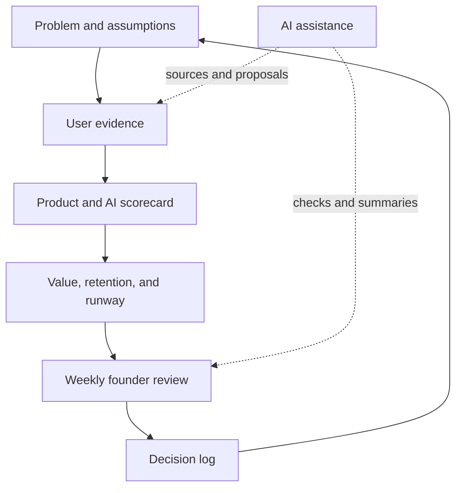

# Chapter 23 — Build Your AI Founder Operating System

> **Core Principle:** Preserve the evidence, decisions, ownership, and review
> dates that keep the company honest.

## Learning Objectives

- Assemble the book’s worksheets into a small operating system.
- Define canonical records and a weekly decision flow.
- Keep AI assistance bounded, reviewable, and subordinate to founder judgment.

## Deep Dive

Your founder operating system is not an application. It is the smallest set of
records and rhythms that helps you see reality and decide. Tools may change; the
decision integrity should remain.

The Startup Playbook connects idea, team, product, execution, growth, and
fundraising as one company system.[^playbook] NIST’s AI RMF emphasizes ongoing
governance, mapping, measurement, and management for AI risk.[^rmf] FounderOS
synthesizes these into seven canonical records:

1. Founder readiness and constraints
2. Problem and wedge
3. Assumption register
4. User evidence log
5. Product and AI release scorecard
6. Value, retention, and runway review
7. Decision log with owner and next review date

Use one source of truth for each record. Link rather than duplicate. Run the
weekly cadence from those records, then archive decisions without erasing the
evidence that produced them.

The system should be easy enough to maintain during a difficult week. Remove a
record that never changes a decision. Add a control only when risk or repeated
failure justifies it.

## AI Founder Interpretation

AI may prepare summaries, retrieve linked evidence, propose options, and check
whether required fields are missing. It must identify sources, label synthesis,
show uncertainty, and wait for a named human decision on consequential actions.

Keep secrets and sensitive user data outside general prompts. Limit tool access,
record approvals, and retain only what the review purpose requires.

## Callouts

### Decision Lens

> **Decision Lens:** Which record would have changed your last important
> decision if it had been current and visible?

### Common Failure

> **Common Failure:** Building a complex management platform before proving a
> weekly decision need. The operating system becomes another product to maintain.

## Diagram

## Checklist

- [ ] Choose one canonical location for each of the seven records.
- [ ] Link evidence and decisions instead of copying them.
- [ ] Schedule the weekly founder review.
- [ ] Define AI permissions, source rules, approval boundaries, and retention.
- [ ] Remove any process that repeatedly fails to change a decision.

## Worksheet

| Canonical record | Location | Human owner | AI assistance allowed | Review rhythm |
| --- | --- | --- | --- | --- |
| Readiness and constraints | | | | |
| Problem and assumptions | | | | |
| User evidence | | | | |
| Product and AI scorecard | | | | |
| Value and runway | | | | |
| Decision log | | | | |

## Key Takeaways

- A founder operating system is a decision practice before it is software.
- One source of truth for each record reduces drift and hidden assumptions.
- AI should retrieve, check, and propose while humans own consequential choices.
- Keep only the process that improves evidence, decisions, ownership, or review.

## Sources

- [Startup Playbook — Y Combinator](https://www.ycombinator.com/blog/startup-playbook/)
- [AI Risk Management Framework — NIST](https://www.nist.gov/itl/ai-risk-management-framework)

[^playbook]: Sam Altman, “Startup Playbook”, Y Combinator.
[^rmf]: National Institute of Standards and Technology, “AI Risk Management Framework.”
