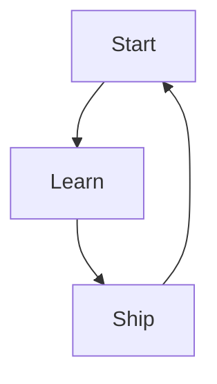

# Chapter X — Title

> **Core Principle:** Replace this with the chapter principle.

## Learning Objectives

- Objective 1
- Objective 2
- Objective 3

## Main Content

## AI Founder Perspective

## Founder Tip

> 💡 **Founder Tip**  
> Add practical advice.

## Common Mistake

> ⚠️ **Common Mistake**  
> Add common mistake.

## Diagram

## Checklist

- [ ] Action 1
- [ ] Action 2

## Worksheet

| Prompt | Answer |
|---|---|
| What assumption must be tested? | |
| Who is the target user? | |

## Key Takeaways

- Takeaway 1
- Takeaway 2

## Sources

- Add sources here.
