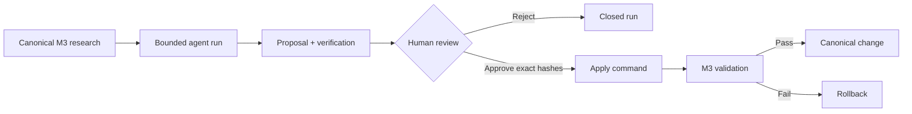

# AI Agent Behavior Specification

## Scope

This specification defines the M4 agent contract, run lifecycle, permission
model, and human approval gate.

## Canonical Artifacts

- Agent definition: role, status, prompt, provider default, permissions, limits
- Run request: identity, subject, provider/model, dates, input hashes, limits
- Proposal: findings and bounded structured changes
- Verification: deterministic schema, identity, path, hash, and injection checks
- Approval: human decision bound to exact hashes
- Summary: status, timing, usage, estimated cost, and artifact inventory

All artifacts conform to `schemas/agents/`. Artifact versions change only with
a compatible migration or accepted RFC.

## Lifecycle

The runtime alone assigns lifecycle status. A model cannot approve, apply, or
claim completion.

## Permissions

Read and proposal paths use repository-relative glob allowlists. All other
paths are denied. Absolute escape, sensitive segments, and symbolic links are
always denied. M4 agent contracts require `shell`, `network`, `git`, and
`publish` to be false.

## Providers and Budgets

The fake provider is deterministic and costs zero. A real provider must use the
same proposal schema, an explicit model, a timeout, output cap, and operator-
supplied current prices. The maximum configured request cost must not exceed the
definition's budget. Actual provider token counts and estimated cost are logged.

## Approval and Application

Approval is a review decision, not an agent output. It records reviewer, time,
proposal hash, and target hashes. Any content change invalidates it. Apply is
limited to schema-approved claim fields, validates each resulting claim, then
validates the whole research graph. Failure restores the original content.

## Acceptance Criteria

- Fake runs and evaluations are deterministic and key-free.
- Real-provider request construction is covered by mocked tests.
- Invalid schemas, forbidden paths, injection markers, budget excess, missing
  approval, rejection, and stale hashes fail closed.
- One sanitized run package demonstrates the lifecycle.
