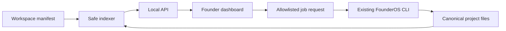

# Local Founder Workspace Specification

## Source of Truth

The workspace manifest registers projects but does not duplicate their content.
Project summaries and job records are derived artifacts. Canonical Markdown,
YAML, JSON, and existing validators remain authoritative.

## Components

## Security Invariants

- The server binds only to `127.0.0.1` or `::1`.
- Project paths remain inside the repository and cannot traverse symbolic links.
- API writes require JSON, same-origin requests, a CSRF token, and confirmation.
- Only predefined command arrays may execute; request data never becomes a shell
  command.
- One job executes at a time. Logs are bounded and secret-shaped values redacted.
- Git, push, publication, remote access, and approval are not platform jobs.

## Acceptance Criteria

- All platform artifacts validate against versioned schemas.
- The index snapshot is deterministic for equal canonical inputs.
- API errors are structured and actionable.
- Interrupted running jobs recover as failed after restart.
- Equal canonical state retains one index generation; changed state increments
  it, while invalid state preserves the last valid view with an error.
- Cancellation terminates the tracked child process and reruns create lineage
  instead of rewriting history.
- The dashboard is keyboard accessible, responsive, and honors reduced motion.
