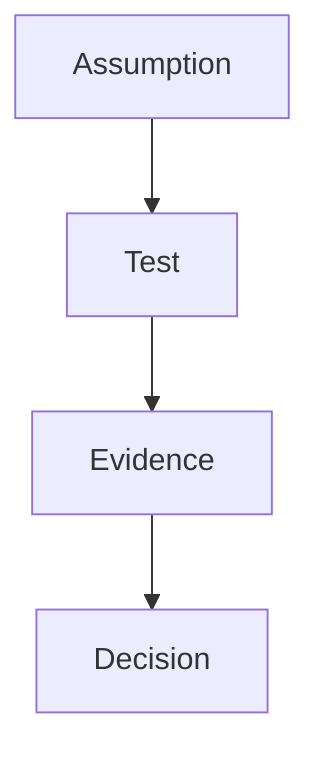

# Chapter 00 — Decision-Oriented Title

> **Core Principle:** State one memorable rule the founder can apply.

## Learning Objectives

- Understand the decision this chapter resolves.
- Recognize strong and weak evidence for that decision.
- Complete the chapter worksheet and choose a review date.

## Deep Dive

Explain the idea in plain language, connect it to a founder decision, and attach
footnotes to external claims.[^source]

## AI Founder Interpretation

Define what AI may assist, what a person must own, and what evidence must remain
reviewable.

## Callouts

### Decision Lens

> **Decision Lens:** Give one question that sharpens the founder’s choice.

### Common Failure

> **Common Failure:** Name one tempting behavior and its consequence.

## Diagram

## Checklist

- [ ] Write the decision in one sentence.
- [ ] Name the evidence needed.
- [ ] Assign an owner and review date.

## Worksheet

| Prompt | Your answer |
| --- | --- |
| Decision | |
| Current assumption | |
| Evidence needed | |
| Owner | |
| Review date | |

## Key Takeaways

- Restate the core principle.
- State the evidence rule.
- State the next action.

## Sources

- [YC’s Essential Startup Advice](https://www.ycombinator.com/blog/ycs-essential-startup-advice/)

[^source]: Y Combinator, “YC’s Essential Startup Advice.”
